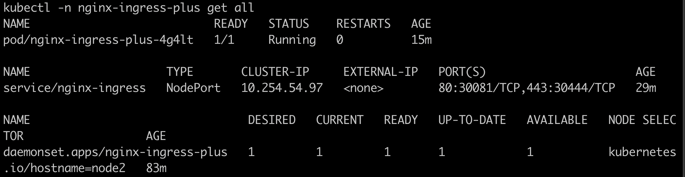
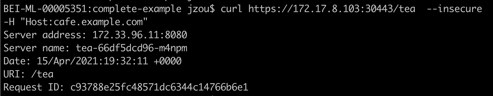
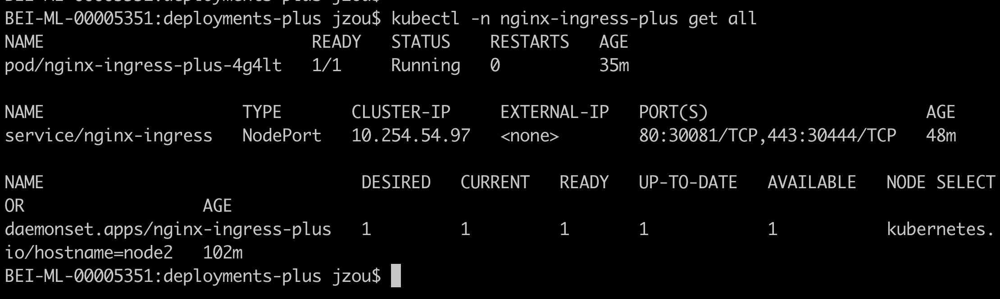
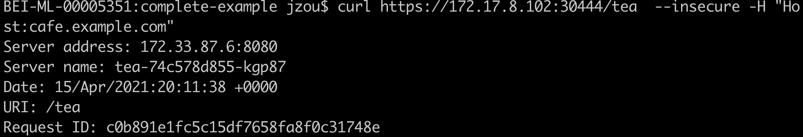

# OSS和N+ KIC安装部署文档(OSS和N+部署在不同节点)
## OSS KIC安装
### 准备OSS KIC镜像
```text

nikeyol/nginx-ingress-oss:1.8.1

```
### 创建namespace及serviceaccount
创建如下的yaml文件，并命名为oss-ns-sa.yaml。并执行kubectl apply -f oss-ns-sa.yaml。
```yaml
apiVersion: v1
kind: Namespace
metadata:
  name: nginx-ingress-oss
---
apiVersion: v1
kind: ServiceAccount
metadata:
  name: nginx-ingress-oss
  namespace: nginx-ingress-oss
```
### 创建rbac
创建如下的yaml文件，并命名为oss-rbac.yaml。并执行kubectl apply -f oss-rbac.yaml。
```yaml
kind: ClusterRole
apiVersion: rbac.authorization.k8s.io/v1beta1
metadata:
  name: nginx-ingress-oss
  namespace: nginx-ingress-oss
rules:
- apiGroups:
  - ""
  resources:
  - services
  - endpoints
  verbs:
  - get
  - list
  - watch
- apiGroups:
  - ""
  resources:
  - secrets
  verbs:
  - get
  - list
  - watch
- apiGroups:
  - ""
  resources:
  - configmaps
  verbs:
  - get
  - list
  - watch
  - update
  - create
- apiGroups:
  - ""
  resources:
  - pods
  verbs:
  - list
  - watch
- apiGroups:
  - ""
  resources:
  - events
  verbs:
  - create
  - patch
  - list
- apiGroups:
  - extensions
  resources:
  - ingresses
  verbs:
  - list
  - watch
  - get
- apiGroups:
  - "extensions"
  resources:
  - ingresses/status
  verbs:
  - update
- apiGroups:
  - k8s.nginx.org
  resources:
  - virtualservers
  - virtualserverroutes
  - globalconfigurations
  - transportservers
  - policies
  verbs:
  - list
  - watch
  - get
- apiGroups:
  - k8s.nginx.org
  resources:
  - virtualservers/status
  - virtualserverroutes/status
  verbs:
  - update
---
kind: ClusterRoleBinding
apiVersion: rbac.authorization.k8s.io/v1beta1
metadata:
  name: nginx-ingress-oss
  namespace: nginx-ingress-oss
subjects:
- kind: ServiceAccount
  name: nginx-ingress-oss
  namespace: nginx-ingress-oss
roleRef:
  kind: ClusterRole
  name: nginx-ingress-oss
  apiGroup: rbac.authorization.k8s.io
```
### 创建configmap
创建如下的yaml文件，并命名为oss-nginx-config.yaml。并执行kubectl apply -f oss-nginx-config.yaml。
```yaml
kind: ConfigMap
apiVersion: v1
metadata:
  name: nginx-config
  namespace: nginx-ingress-oss
data:
```
### 创建IC的daemonset部署
创建如下的yaml文件，并命名为nginx-ingress-oss.yaml。并执行kubectl apply -f nginx-ingress-oss.yaml。注意：需要替换镜像地址,参数“-watch-namespace”及nodeSelector。
```yaml
apiVersion: apps/v1
kind: DaemonSet
metadata:
  name: nginx-ingress-oss
  namespace: nginx-ingress-oss
  annotations:
    kubernetes.io/ingress.class: "nginx-oss"
spec:
  selector:
    matchLabels:
      app: nginx-ingress
  template:
    metadata:
      labels:
        app: nginx-ingress
     #annotations:
       #prometheus.io/scrape: "true"
       #prometheus.io/port: "9113"
    spec:
      serviceAccountName: nginx-ingress-oss
      hostNetwork: true
      nodeSelector:
        kubernetes.io/hostname: node3
      containers:
      - image: praqma/network-multitool
        imagePullPolicy: IfNotPresent
        name: nginx-busybox
        command: [ "/bin/sh" ]
        args:
        - "-c"
        - "while true; do RAND=$(shuf -i 1-10 -n 1); echo ${RAND} > /var/log/num.log; sleep 5; done"
      - image: nikeyol/nginx-ingress-oss:1.8.1
        imagePullPolicy: IfNotPresent
        name: nginx-ingress
        ports:
        - name: http
          containerPort: 9090
          hostPort: 9090
        - name: https
          containerPort: 8443
          hostPort: 8443
        - name: readiness-port
          containerPort: 8081
       #- name: prometheus
         #containerPort: 9113
        readinessProbe:
         httpGet:
           path: /nginx-ready
           port: readiness-port
         periodSeconds: 1
        securityContext:
          allowPrivilegeEscalation: true
          runAsUser: 101 #nginx
          capabilities:
            drop:
            - ALL
            add:
            - NET_BIND_SERVICE
        env:
        - name: POD_NAMESPACE
          valueFrom:
            fieldRef:
              fieldPath: metadata.namespace
        - name: POD_NAME
          valueFrom:
            fieldRef:
              fieldPath: metadata.name
        args:
          - -nginx-configmaps=$(POD_NAMESPACE)/nginx-config
          - -default-server-tls-secret=$(POD_NAMESPACE)/default-server-secret
          - -ingress-class=nginx-oss
          - -watch-namespace=example-oss
         #- -v=3 # Enables extensive logging. Useful for troubleshooting.
         #- -report-ingress-status
         #- -external-service=nginx-ingress
         #- -enable-prometheus-metrics
         #- -global-configuration=$(POD_NAMESPACE)/nginx-configuration
```
### 确认IC Pod运行成功

### 创建nodeport
创建如下yaml文件，并命名为ingress-oss-nodeport.yaml,并执行kubectl apply -f ingress-oss-nodeport.yaml。
```
apiVersion: v1
kind: Service
metadata:
  name: nginx-ingress-oss
  namespace: nginx-ingress-oss
spec:
  type: NodePort
  ports:
  - port: 80
    targetPort: 80
    nodePort: 30080
    protocol: TCP
    name: http
  - port: 443
    targetPort: 443
    nodePort: 30443
    protocol: TCP
    name: https
  selector:
    app: nginx-ingress
```
## OSS KIC功能验证
### 部署Sample App
```yaml
apiVersion: v1
kind: Namespace
metadata:
  name: example-oss
---
apiVersion: v1
kind: Secret
metadata:
  name: cafe-secret
  namespace: example-oss
type: Opaque
data:
  tls.crt: LS0tLS1CRUdJTiBDRVJUSUZJQ0FURS0tLS0tCk1JSURMakNDQWhZQ0NRREFPRjl0THNhWFdqQU5CZ2txaGtpRzl3MEJBUXNGQURCYU1Rc3dDUVlEVlFRR0V3SlYKVXpFTE1Ba0dBMVVFQ0F3Q1EwRXhJVEFmQmdOVkJBb01HRWx1ZEdWeWJtVjBJRmRwWkdkcGRITWdVSFI1SUV4MApaREViTUJrR0ExVUVBd3dTWTJGbVpTNWxlR0Z0Y0d4bExtTnZiU0FnTUI0WERURTRNRGt4TWpFMk1UVXpOVm9YCkRUSXpNRGt4TVRFMk1UVXpOVm93V0RFTE1Ba0dBMVVFQmhNQ1ZWTXhDekFKQmdOVkJBZ01Ba05CTVNFd0h3WUQKVlFRS0RCaEpiblJsY201bGRDQlhhV1JuYVhSeklGQjBlU0JNZEdReEdUQVhCZ05WQkFNTUVHTmhabVV1WlhoaApiWEJzWlM1amIyMHdnZ0VpTUEwR0NTcUdTSWIzRFFFQkFRVUFBNElCRHdBd2dnRUtBb0lCQVFDcDZLbjdzeTgxCnAwanVKL2N5ayt2Q0FtbHNmanRGTTJtdVpOSzBLdGVjcUcyZmpXUWI1NXhRMVlGQTJYT1N3SEFZdlNkd0kyaloKcnVXOHFYWENMMnJiNENaQ0Z4d3BWRUNyY3hkam0zdGVWaVJYVnNZSW1tSkhQUFN5UWdwaW9iczl4N0RsTGM2SQpCQTBaalVPeWwwUHFHOVNKZXhNVjczV0lJYTVyRFZTRjJyNGtTa2JBajREY2o3TFhlRmxWWEgySTVYd1hDcHRDCm42N0pDZzQyZitrOHdnemNSVnA4WFprWldaVmp3cTlSVUtEWG1GQjJZeU4xWEVXZFowZXdSdUtZVUpsc202OTIKc2tPcktRajB2a29QbjQxRUUvK1RhVkVwcUxUUm9VWTNyemc3RGtkemZkQml6Rk8yZHNQTkZ4MkNXMGpYa05MdgpLbzI1Q1pyT2hYQUhBZ01CQUFFd0RRWUpLb1pJaHZjTkFRRUxCUUFEZ2dFQkFLSEZDY3lPalp2b0hzd1VCTWRMClJkSEliMzgzcFdGeW5acS9MdVVvdnNWQTU4QjBDZzdCRWZ5NXZXVlZycTVSSWt2NGxaODFOMjl4MjFkMUpINnIKalNuUXgrRFhDTy9USkVWNWxTQ1VwSUd6RVVZYVVQZ1J5anNNL05VZENKOHVIVmhaSitTNkZBK0NuT0Q5cm4yaQpaQmVQQ0k1ckh3RVh3bm5sOHl3aWozdnZRNXpISXV5QmdsV3IvUXl1aTlmalBwd1dVdlVtNG52NVNNRzl6Q1Y3ClBwdXd2dWF0cWpPMTIwOEJqZkUvY1pISWc4SHc5bXZXOXg5QytJUU1JTURFN2IvZzZPY0s3TEdUTHdsRnh2QTgKN1dqRWVxdW5heUlwaE1oS1JYVmYxTjM0OWVOOThFejM4Zk9USFRQYmRKakZBL1BjQytHeW1lK2lHdDVPUWRGaAp5UkU9Ci0tLS0tRU5EIENFUlRJRklDQVRFLS0tLS0K
  tls.key: LS0tLS1CRUdJTiBSU0EgUFJJVkFURSBLRVktLS0tLQpNSUlFb3dJQkFBS0NBUUVBcWVpcCs3TXZOYWRJN2lmM01wUHJ3Z0pwYkg0N1JUTnBybVRTdENyWG5LaHRuNDFrCkcrZWNVTldCUU5semtzQndHTDBuY0NObzJhN2x2S2wxd2k5cTIrQW1RaGNjS1ZSQXEzTVhZNXQ3WGxZa1YxYkcKQ0pwaVJ6ejBza0lLWXFHN1BjZXc1UzNPaUFRTkdZMURzcGRENmh2VWlYc1RGZTkxaUNHdWF3MVVoZHErSkVwRwp3SStBM0kreTEzaFpWVng5aU9WOEZ3cWJRcCt1eVFvT05uL3BQTUlNM0VWYWZGMlpHVm1WWThLdlVWQ2cxNWhRCmRtTWpkVnhGbldkSHNFYmltRkNaYkp1dmRySkRxeWtJOUw1S0Q1K05SQlAvazJsUkthaTAwYUZHTjY4NE93NUgKYzMzUVlzeFR0bmJEelJjZGdsdEkxNURTN3lxTnVRbWF6b1Z3QndJREFRQUJBb0lCQVFDUFNkU1luUXRTUHlxbApGZlZGcFRPc29PWVJoZjhzSStpYkZ4SU91UmF1V2VoaEp4ZG01Uk9ScEF6bUNMeUw1VmhqdEptZTIyM2dMcncyCk45OUVqVUtiL1ZPbVp1RHNCYzZvQ0Y2UU5SNThkejhjbk9SVGV3Y290c0pSMXBuMWhobG5SNUhxSkpCSmFzazEKWkVuVVFmY1hackw5NGxvOUpIM0UrVXFqbzFGRnM4eHhFOHdvUEJxalpzVjdwUlVaZ0MzTGh4bndMU0V4eUZvNApjeGI5U09HNU9tQUpvelN0Rm9RMkdKT2VzOHJKNXFmZHZ5dGdnOXhiTGFRTC94MGtwUTYyQm9GTUJEZHFPZVBXCktmUDV6WjYvMDcvdnBqNDh5QTFRMzJQem9idWJzQkxkM0tjbjMyamZtMUU3cHJ0V2wrSmVPRmlPem5CUUZKYk4KNHFQVlJ6NWhBb0dCQU50V3l4aE5DU0x1NFArWGdLeWNrbGpKNkY1NjY4Zk5qNUN6Z0ZScUowOXpuMFRsc05ybwpGVExaY3hEcW5SM0hQWU00MkpFUmgySi9xREZaeW5SUW8zY2czb2VpdlVkQlZHWTgrRkkxVzBxZHViL0w5K3l1CmVkT1pUUTVYbUdHcDZyNmpleHltY0ppbS9Pc0IzWm5ZT3BPcmxEN1NQbUJ2ek5MazRNRjZneGJYQW9HQkFNWk8KMHA2SGJCbWNQMHRqRlhmY0tFNzdJbUxtMHNBRzR1SG9VeDBlUGovMnFyblRuT0JCTkU0TXZnRHVUSnp5K2NhVQprOFJxbWRIQ2JIelRlNmZ6WXEvOWl0OHNaNzdLVk4xcWtiSWN1YytSVHhBOW5OaDFUanNSbmU3NFowajFGQ0xrCmhIY3FIMHJpN1BZU0tIVEU4RnZGQ3haWWRidUI4NENtWmlodnhicFJBb0dBSWJqcWFNWVBUWXVrbENkYTVTNzkKWVNGSjFKelplMUtqYS8vdER3MXpGY2dWQ0thMzFqQXdjaXowZi9sU1JxM0hTMUdHR21lemhQVlRpcUxmZVpxYwpSMGlLYmhnYk9jVlZrSkozSzB5QXlLd1BUdW14S0haNnpJbVpTMGMwYW0rUlk5WUdxNVQ3WXJ6cHpjZnZwaU9VCmZmZTNSeUZUN2NmQ21mb09oREN0enVrQ2dZQjMwb0xDMVJMRk9ycW40M3ZDUzUxemM1em9ZNDR1QnpzcHd3WU4KVHd2UC9FeFdNZjNWSnJEakJDSCtULzZzeXNlUGJKRUltbHpNK0l3eXRGcEFOZmlJWEV0LzQ4WGY2ME54OGdXTQp1SHl4Wlp4L05LdER3MFY4dlgxUE9ucTJBNWVpS2ErOGpSQVJZS0pMWU5kZkR1d29seHZHNmJaaGtQaS80RXRUCjNZMThzUUtCZ0h0S2JrKzdsTkpWZXN3WEU1Y1VHNkVEVXNEZS8yVWE3ZlhwN0ZjanFCRW9hcDFMU3crNlRYcDAKWmdybUtFOEFSek00NytFSkhVdmlpcS9udXBFMTVnMGtKVzNzeWhwVTl6WkxPN2x0QjBLSWtPOVpSY21Vam84UQpjcExsSE1BcWJMSjhXWUdKQ2toaVd4eWFsNmhZVHlXWTRjVmtDMHh0VGwvaFVFOUllTktvCi0tLS0tRU5EIFJTQSBQUklWQVRFIEtFWS0tLS0tCg==
```

```yaml
apiVersion: apps/v1
kind: Deployment
metadata:
  name: coffee
  namespace: example-oss
spec:
  replicas: 2
  selector:
    matchLabels:
      app: coffee
  template:
    metadata:
      labels:
        app: coffee
    spec:
      nodeSelector:
        kubernetes.io/hostname: node3
      containers:
      - name: coffee
        image: nginxdemos/nginx-hello:plain-text
        ports:
        - containerPort: 8080
---
apiVersion: v1
kind: Service
metadata:
  name: coffee-svc
  namespace: example-oss
spec:
  ports:
  - port: 80
    targetPort: 8080
    protocol: TCP
    name: http
  selector:
    app: coffee
---
apiVersion: apps/v1
kind: Deployment
metadata:
  name: tea
  namespace: example-oss
spec:
  replicas: 3
  selector:
    matchLabels:
      app: tea
  template:
    metadata:
      labels:
        app: tea
    spec:
      nodeSelector:
        kubernetes.io/hostname: node3
      containers:
      - name: tea
        image: nginxdemos/nginx-hello:plain-text
        ports:
        - containerPort: 8080
---
apiVersion: v1
kind: Service
metadata:
  name: tea-svc
  namespace: example-oss
spec:
  ports:
  - port: 80
    targetPort: 8080
    protocol: TCP
    name: http
  selector:
    app: tea
```
```yaml
apiVersion: extensions/v1beta1
kind: Ingress
metadata:
  name: cafe-ingress
  namespace: example-oss
  annotations:
    kubernetes.io/ingress.class: "nginx-oss"
spec:
  tls:
  - hosts:
    - cafe.example.com
    secretName: cafe-secret
  rules:
  - host: cafe.example.com
    http:
      paths:
      - path: /tea
        backend:
          serviceName: tea-svc
          servicePort: 80
      - path: /coffee
        backend:
          serviceName: coffee-svc
          servicePort: 80
```
### 验证成功访问Sample App


## N+ KIC安装
### 准备N+ KIC镜像
```text

nikeyol/nginx-ingress-plus:1.8.1

```
### 创建namespace及serviceaccount
创建如下的yaml文件，并命名为plus-ns-sa.yaml。并执行kubectl apply -f plus-ns-sa.yaml。
```yaml
apiVersion: v1
kind: Namespace
metadata:
  name: nginx-ingress-plus
---
apiVersion: v1
kind: ServiceAccount
metadata:
  name: nginx-ingress-plus
  namespace: nginx-ingress-plus
```
### 创建rbac
创建如下的yaml文件，并命名为plus-rbac.yaml。并执行kubectl apply -f plus-rbac.yaml。
```yaml
kind: ClusterRole
apiVersion: rbac.authorization.k8s.io/v1beta1
metadata:
  name: nginx-ingress-plus
  namespace: nginx-ingress-plus
rules:
- apiGroups:
  - ""
  resources:
  - services
  - endpoints
  verbs:
  - get
  - list
  - watch
- apiGroups:
  - ""
  resources:
  - secrets
  verbs:
  - get
  - list
  - watch
- apiGroups:
  - ""
  resources:
  - configmaps
  verbs:
  - get
  - list
  - watch
  - update
  - create
- apiGroups:
  - ""
  resources:
  - pods
  verbs:
  - list
  - watch
- apiGroups:
  - ""
  resources:
  - events
  verbs:
  - create
  - patch
  - list
- apiGroups:
  - extensions
  resources:
  - ingresses
  verbs:
  - list
  - watch
  - get
- apiGroups:
  - "extensions"
  resources:
  - ingresses/status
  verbs:
  - update
- apiGroups:
  - k8s.nginx.org
  resources:
  - virtualservers
  - virtualserverroutes
  - globalconfigurations
  - transportservers
  - policies
  verbs:
  - list
  - watch
  - get
- apiGroups:
  - k8s.nginx.org
  resources:
  - virtualservers/status
  - virtualserverroutes/status
  verbs:
  - update
---
kind: ClusterRoleBinding
apiVersion: rbac.authorization.k8s.io/v1beta1
metadata:
  name: nginx-ingress-plus
  namespace: nginx-ingress-plus
subjects:
- kind: ServiceAccount
  name: nginx-ingress-plus
  namespace: nginx-ingress-plus
roleRef:
  kind: ClusterRole
  name: nginx-ingress-plus
  apiGroup: rbac.authorization.k8s.io
```
### 创建configmap
创建如下的yaml文件，并命名为plus-nginx-config.yaml。并执行kubectl apply -f plus-nginx-config.yaml。
```yaml
kind: ConfigMap
apiVersion: v1
metadata:
  name: nginx-config
  namespace: nginx-ingress-plus
data:
```
### 创建IC的daemonset部署
创建如下的yaml文件，并命名为nginx-ingress-plus.yaml。并执行kubectl apply -f nginx-ingress-plus.yaml。注意：需要替换镜像地址,参数“-watch-namespace”及nodeSelector。
```yaml
apiVersion: apps/v1
kind: DaemonSet
metadata:
  name: nginx-ingress-plus
  namespace: nginx-ingress-plus
  annotations:
    kubernetes.io/ingress.class: "nginx-plus"
spec:
  selector:
    matchLabels:
      app: nginx-ingress
  template:
    metadata:
      labels:
        app: nginx-ingress
     #annotations:
       #prometheus.io/scrape: "true"
       #prometheus.io/port: "9113"
    spec:
      serviceAccountName: nginx-ingress-plus
      hostNetwork: true
      nodeSelector:
        kubernetes.io/hostname: node2
      containers:
      - image: nikeyol/nginx-ingress-plus:1.8.1
        imagePullPolicy: IfNotPresent
        name: nginx-plus-ingress
        ports:
        - name: http
          containerPort: 80
        - name: https
          containerPort: 443
        - name: readiness-port
          containerPort: 8081
       #- name: prometheus
         #containerPort: 9113
        readinessProbe:
          httpGet:
            path: /nginx-ready
            port: readiness-port
          periodSeconds: 1
        securityContext:
          allowPrivilegeEscalation: true
          runAsUser: 101 #nginx
          capabilities:
            drop:
            - ALL
            add:
            - NET_BIND_SERVICE
        env:
        - name: POD_NAMESPACE
          valueFrom:
            fieldRef:
              fieldPath: metadata.namespace
        - name: POD_NAME
          valueFrom:
            fieldRef:
              fieldPath: metadata.name
        args:
          - -nginx-plus
          - -nginx-configmaps=$(POD_NAMESPACE)/nginx-config
          - -default-server-tls-secret=$(POD_NAMESPACE)/default-server-secret
          - -ingress-class=nginx-plus
          - -watch-namespace=example-plus
         # - -http-port=8090
         # - -https-port=9443
         #- -enable-app-protect
         #- -v=3 # Enables extensive logging. Useful for troubleshooting.
         #- -report-ingress-status
         #- -external-service=nginx-ingress
         #- -enable-prometheus-metrics
         #- -global-configuration=$(POD_NAMESPACE)/nginx-configuration
```
### 确认IC Pod运行成功

### 创建nodeport
创建如下yaml文件，并命名为ingress-plus-nodeport.yaml,并执行kubectl apply -f ingress-plus-nodeport.yaml。
```yaml
apiVersion: v1
kind: Service
metadata:
  name: nginx-ingress
  namespace: nginx-ingress-plus
spec:
  type: NodePort
  ports:
  - port: 80
    targetPort: 80
    nodePort: 30081
    protocol: TCP
    name: http
  - port: 443
    targetPort: 443
    nodePort: 30444
    protocol: TCP
    name: https
  selector:
    app: nginx-ingress
```
```
## N+ KIC功能验证
### 部署Sample App
```yaml
apiVersion: v1
kind: Namespace
metadata:
  name: example-plus
---
apiVersion: v1
kind: Secret
metadata:
  name: cafe-secret
  namespace: example-plus
type: Opaque
data:
  tls.crt: LS0tLS1CRUdJTiBDRVJUSUZJQ0FURS0tLS0tCk1JSURMakNDQWhZQ0NRREFPRjl0THNhWFdqQU5CZ2txaGtpRzl3MEJBUXNGQURCYU1Rc3dDUVlEVlFRR0V3SlYKVXpFTE1Ba0dBMVVFQ0F3Q1EwRXhJVEFmQmdOVkJBb01HRWx1ZEdWeWJtVjBJRmRwWkdkcGRITWdVSFI1SUV4MApaREViTUJrR0ExVUVBd3dTWTJGbVpTNWxlR0Z0Y0d4bExtTnZiU0FnTUI0WERURTRNRGt4TWpFMk1UVXpOVm9YCkRUSXpNRGt4TVRFMk1UVXpOVm93V0RFTE1Ba0dBMVVFQmhNQ1ZWTXhDekFKQmdOVkJBZ01Ba05CTVNFd0h3WUQKVlFRS0RCaEpiblJsY201bGRDQlhhV1JuYVhSeklGQjBlU0JNZEdReEdUQVhCZ05WQkFNTUVHTmhabVV1WlhoaApiWEJzWlM1amIyMHdnZ0VpTUEwR0NTcUdTSWIzRFFFQkFRVUFBNElCRHdBd2dnRUtBb0lCQVFDcDZLbjdzeTgxCnAwanVKL2N5ayt2Q0FtbHNmanRGTTJtdVpOSzBLdGVjcUcyZmpXUWI1NXhRMVlGQTJYT1N3SEFZdlNkd0kyaloKcnVXOHFYWENMMnJiNENaQ0Z4d3BWRUNyY3hkam0zdGVWaVJYVnNZSW1tSkhQUFN5UWdwaW9iczl4N0RsTGM2SQpCQTBaalVPeWwwUHFHOVNKZXhNVjczV0lJYTVyRFZTRjJyNGtTa2JBajREY2o3TFhlRmxWWEgySTVYd1hDcHRDCm42N0pDZzQyZitrOHdnemNSVnA4WFprWldaVmp3cTlSVUtEWG1GQjJZeU4xWEVXZFowZXdSdUtZVUpsc202OTIKc2tPcktRajB2a29QbjQxRUUvK1RhVkVwcUxUUm9VWTNyemc3RGtkemZkQml6Rk8yZHNQTkZ4MkNXMGpYa05MdgpLbzI1Q1pyT2hYQUhBZ01CQUFFd0RRWUpLb1pJaHZjTkFRRUxCUUFEZ2dFQkFLSEZDY3lPalp2b0hzd1VCTWRMClJkSEliMzgzcFdGeW5acS9MdVVvdnNWQTU4QjBDZzdCRWZ5NXZXVlZycTVSSWt2NGxaODFOMjl4MjFkMUpINnIKalNuUXgrRFhDTy9USkVWNWxTQ1VwSUd6RVVZYVVQZ1J5anNNL05VZENKOHVIVmhaSitTNkZBK0NuT0Q5cm4yaQpaQmVQQ0k1ckh3RVh3bm5sOHl3aWozdnZRNXpISXV5QmdsV3IvUXl1aTlmalBwd1dVdlVtNG52NVNNRzl6Q1Y3ClBwdXd2dWF0cWpPMTIwOEJqZkUvY1pISWc4SHc5bXZXOXg5QytJUU1JTURFN2IvZzZPY0s3TEdUTHdsRnh2QTgKN1dqRWVxdW5heUlwaE1oS1JYVmYxTjM0OWVOOThFejM4Zk9USFRQYmRKakZBL1BjQytHeW1lK2lHdDVPUWRGaAp5UkU9Ci0tLS0tRU5EIENFUlRJRklDQVRFLS0tLS0K
  tls.key: LS0tLS1CRUdJTiBSU0EgUFJJVkFURSBLRVktLS0tLQpNSUlFb3dJQkFBS0NBUUVBcWVpcCs3TXZOYWRJN2lmM01wUHJ3Z0pwYkg0N1JUTnBybVRTdENyWG5LaHRuNDFrCkcrZWNVTldCUU5semtzQndHTDBuY0NObzJhN2x2S2wxd2k5cTIrQW1RaGNjS1ZSQXEzTVhZNXQ3WGxZa1YxYkcKQ0pwaVJ6ejBza0lLWXFHN1BjZXc1UzNPaUFRTkdZMURzcGRENmh2VWlYc1RGZTkxaUNHdWF3MVVoZHErSkVwRwp3SStBM0kreTEzaFpWVng5aU9WOEZ3cWJRcCt1eVFvT05uL3BQTUlNM0VWYWZGMlpHVm1WWThLdlVWQ2cxNWhRCmRtTWpkVnhGbldkSHNFYmltRkNaYkp1dmRySkRxeWtJOUw1S0Q1K05SQlAvazJsUkthaTAwYUZHTjY4NE93NUgKYzMzUVlzeFR0bmJEelJjZGdsdEkxNURTN3lxTnVRbWF6b1Z3QndJREFRQUJBb0lCQVFDUFNkU1luUXRTUHlxbApGZlZGcFRPc29PWVJoZjhzSStpYkZ4SU91UmF1V2VoaEp4ZG01Uk9ScEF6bUNMeUw1VmhqdEptZTIyM2dMcncyCk45OUVqVUtiL1ZPbVp1RHNCYzZvQ0Y2UU5SNThkejhjbk9SVGV3Y290c0pSMXBuMWhobG5SNUhxSkpCSmFzazEKWkVuVVFmY1hackw5NGxvOUpIM0UrVXFqbzFGRnM4eHhFOHdvUEJxalpzVjdwUlVaZ0MzTGh4bndMU0V4eUZvNApjeGI5U09HNU9tQUpvelN0Rm9RMkdKT2VzOHJKNXFmZHZ5dGdnOXhiTGFRTC94MGtwUTYyQm9GTUJEZHFPZVBXCktmUDV6WjYvMDcvdnBqNDh5QTFRMzJQem9idWJzQkxkM0tjbjMyamZtMUU3cHJ0V2wrSmVPRmlPem5CUUZKYk4KNHFQVlJ6NWhBb0dCQU50V3l4aE5DU0x1NFArWGdLeWNrbGpKNkY1NjY4Zk5qNUN6Z0ZScUowOXpuMFRsc05ybwpGVExaY3hEcW5SM0hQWU00MkpFUmgySi9xREZaeW5SUW8zY2czb2VpdlVkQlZHWTgrRkkxVzBxZHViL0w5K3l1CmVkT1pUUTVYbUdHcDZyNmpleHltY0ppbS9Pc0IzWm5ZT3BPcmxEN1NQbUJ2ek5MazRNRjZneGJYQW9HQkFNWk8KMHA2SGJCbWNQMHRqRlhmY0tFNzdJbUxtMHNBRzR1SG9VeDBlUGovMnFyblRuT0JCTkU0TXZnRHVUSnp5K2NhVQprOFJxbWRIQ2JIelRlNmZ6WXEvOWl0OHNaNzdLVk4xcWtiSWN1YytSVHhBOW5OaDFUanNSbmU3NFowajFGQ0xrCmhIY3FIMHJpN1BZU0tIVEU4RnZGQ3haWWRidUI4NENtWmlodnhicFJBb0dBSWJqcWFNWVBUWXVrbENkYTVTNzkKWVNGSjFKelplMUtqYS8vdER3MXpGY2dWQ0thMzFqQXdjaXowZi9sU1JxM0hTMUdHR21lemhQVlRpcUxmZVpxYwpSMGlLYmhnYk9jVlZrSkozSzB5QXlLd1BUdW14S0haNnpJbVpTMGMwYW0rUlk5WUdxNVQ3WXJ6cHpjZnZwaU9VCmZmZTNSeUZUN2NmQ21mb09oREN0enVrQ2dZQjMwb0xDMVJMRk9ycW40M3ZDUzUxemM1em9ZNDR1QnpzcHd3WU4KVHd2UC9FeFdNZjNWSnJEakJDSCtULzZzeXNlUGJKRUltbHpNK0l3eXRGcEFOZmlJWEV0LzQ4WGY2ME54OGdXTQp1SHl4Wlp4L05LdER3MFY4dlgxUE9ucTJBNWVpS2ErOGpSQVJZS0pMWU5kZkR1d29seHZHNmJaaGtQaS80RXRUCjNZMThzUUtCZ0h0S2JrKzdsTkpWZXN3WEU1Y1VHNkVEVXNEZS8yVWE3ZlhwN0ZjanFCRW9hcDFMU3crNlRYcDAKWmdybUtFOEFSek00NytFSkhVdmlpcS9udXBFMTVnMGtKVzNzeWhwVTl6WkxPN2x0QjBLSWtPOVpSY21Vam84UQpjcExsSE1BcWJMSjhXWUdKQ2toaVd4eWFsNmhZVHlXWTRjVmtDMHh0VGwvaFVFOUllTktvCi0tLS0tRU5EIFJTQSBQUklWQVRFIEtFWS0tLS0tCg==
---
apiVersion: apps/v1
kind: Deployment
metadata:
  name: coffee
  namespace: example-plus
spec:
  replicas: 2
  selector:
    matchLabels:
      app: coffee
  template:
    metadata:
      labels:
        app: coffee
    spec:
      nodeSelector:
        kubernetes.io/hostname: node2
      containers:
      - name: coffee
        image: nginxdemos/nginx-hello:plain-text
        ports:
        - containerPort: 8080
---
apiVersion: v1
kind: Service
metadata:
  name: coffee-svc
  namespace: example-plus
spec:
  ports:
  - port: 80
    targetPort: 8080
    protocol: TCP
    name: http
  selector:
    app: coffee
---
apiVersion: apps/v1
kind: Deployment
metadata:
  name: tea
  namespace: example-plus
spec:
  replicas: 3
  selector:
    matchLabels:
      app: tea
  template:
    metadata:
      labels:
        app: tea
    spec:
      nodeSelector:
        kubernetes.io/hostname: node2
      containers:
      - name: tea
        image: nginxdemos/nginx-hello:plain-text
        ports:
        - containerPort: 8080
---
apiVersion: v1
kind: Service
metadata:
  name: tea-svc
  namespace: example-plus
spec:
  ports:
  - port: 80
    targetPort: 8080
    protocol: TCP
    name: http
  selector:
    app: tea
---
apiVersion: extensions/v1beta1
kind: Ingress
metadata:
  name: cafe-ingress
  namespace: example-plus
  annotations:
    kubernetes.io/ingress.class: "nginx-plus"
spec:
  tls:
  - hosts:
    - cafe.example.com
    secretName: cafe-secret
  rules:
  - host: cafe.example.com
    http:
      paths:
      - path: /tea
        backend:
          serviceName: tea-svc
          servicePort: 80
      - path: /coffee
        backend:
          serviceName: coffee-svc
          servicePort: 80
```
### 验证成功访问Sample App

